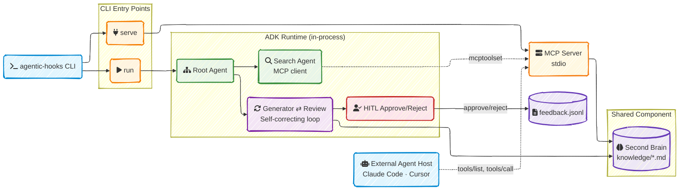
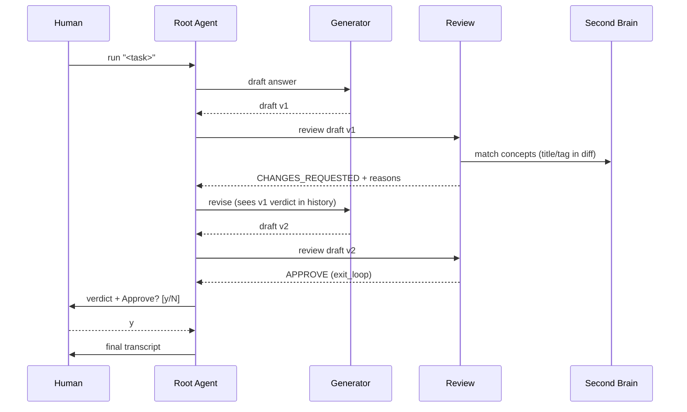

# agentic-hooks

[![Go][Go]][Go-url] [![ADK][ADK]][ADK-url] [![MCP SDK][MCP]][MCP-url] [![Cobra][Cobra]][Cobra-url]

A **Second Brain orchestration CLI**, built on **Go ADK v2**. A Search agent and a self-correcting Generator↔Review loop answer a task against a personal knowledge base of engineering principles, gated by a human approve/reject checkpoint. The same knowledge base is also exposed as an **MCP server**, so external agent hosts (Claude Code, Cursor, etc.) can query it directly over stdio.

---

## 📋 Table of Contents

- [agentic-hooks](#agentic-hooks)
  - [📋 Table of Contents](#-table-of-contents)
  - [🏗️ Architecture](#️-architecture)
  - [🔁 The Self-Correcting Loop](#-the-self-correcting-loop)
  - [🔌 Add to Your MCP Client](#-add-to-your-mcp-client)
  - [🚀 Quick Start](#-quick-start)
  - [🔧 Build Commands](#-build-commands)
  - [🛠️ Tech Stack](#️-tech-stack)
  - [📁 Project Structure](#-project-structure)
  - [⚙️ Configuration](#️-configuration)
  - [🌐 MCP Tools](#-mcp-tools)
  - [🧪 Testing, Benchmarking & Eval](#-testing-benchmarking--eval)
  - [🤖 Agents \& Skills](#-agents--skills)
  - [⚠️ Known Limitations](#️-known-limitations)
  - [🔒 Privacy](#-privacy)
  - [📚 Documentation](#-documentation)
  - [🤝 Contributing](#-contributing)
  - [📄 License](#-license)

---

## 🏗️ Architecture



**What this does:**

- **Search** — an MCP-client sub-agent that can query any configured MCP server for supporting context.
- **Generate + Review** — a Generator drafts an answer; a Review agent critiques it against the Second Brain and either `APPROVE`s or requests changes, looping until convergence or `--max-iterations`.
- **Human-in-the-loop** — nothing is treated as final output without an explicit approve/reject from a human.
- **Feedback log** — every run (approved or rejected) is appended to `feedback/feedback.jsonl` as an audit trail.
- **MCP server** — the same Second Brain is queryable by any external MCP-compatible agent host, independent of the pipeline above.

---

## 🔁 The Self-Correcting Loop



Bounded by `--max-iterations` (default 4) so a non-converging task returns the Generator's best-effort draft instead of looping forever. `retryandreflect` (ADK's tool-call self-healing plugin) is attached for resilience against transient tool-call failures.

---

## 🔌 Add to Your MCP Client

`agentic-hooks serve` runs over **stdio only** (no HTTP transport in this project).

**Step 1 — build the binary:**

```bash
make build
# Binary: bin/agentic-hooks
```

**Step 2 — point your MCP client at it.** Example for Claude Desktop-style config (`claude_desktop_config.json`) or a project-level `.mcp.json`:

```json
{
  "mcpServers": {
    "agentic-hooks": {
      "type": "stdio",
      "command": "/absolute/path/to/bin/agentic-hooks",
      "args": ["serve", "--knowledge-dir", "/absolute/path/to/knowledge"]
    }
  }
}
```

**Step 3 — restart your client.** `list_knowledge` and `get_knowledge` appear in its tool list.

To verify manually without a full client, use MCP Inspector CLI (see [TESTING.md](TESTING.md)) or this project's own `mcp-inspector-tester` subagent.

---

## 🚀 Quick Start

### Prerequisites

- Go 1.25+
- `GEMINI_API_KEY` (falls back to `GOOGLE_API_KEY`) — only needed for `make dev`/`make eval`, not for build/test/serve.

```bash
# Clone
git clone <this-repo>
cd agentic-hooks

# Build
make build

# Start the MCP server over stdio
make server

# Run the Search+Review loop on a task
make dev TASK="review: func DoEverything() { validates input, writes to disk, sends email, all in one func }"
```

`make dev` also accepts `FILE=path/to/code.go` to review a real file, or run bare to be prompted interactively.

---

## 🔧 Build Commands

| Command | What it does |
|---|---|
| `make build` | Builds `bin/agentic-hooks` with version/build-time ldflags |
| `make server` | Starts the MCP server over stdio (`serve` subcommand) |
| `make dev` | Runs the Search+Review loop + HITL (`FILE=`, `TASK=`, or interactive prompt) |
| `make test` | `go test ./... -v` |
| `make vet` | `go vet ./...` |
| `make check` | `vet` + `test` + `build` |
| `make bench` | Go-native benchmarks (`go test -bench`), no API cost |
| `make eval` | Golden-set eval against the real model (costs API calls) |
| `make tidy` | `go mod tidy` |
| `make clean` | Removes `bin/` |
| `make help` | Prints all targets |

---

## 🛠️ Tech Stack

| Component | Version | Purpose |
|---|---|---|
| Go | 1.25 | Primary language |
| `google.golang.org/adk/v2` | v2.0.0 | Multi-agent orchestration runtime — sub-agent delegation, loop workflows, HITL confirmation |
| `google.golang.org/genai` | v1.57.0 | Gemini model client |
| `github.com/modelcontextprotocol/go-sdk` | v1.6.1 | Official MCP SDK — used both as client (Search agent) and server (`serve`) |
| `github.com/spf13/cobra` | v1.10.2 | CLI subcommands (`run`, `serve`, `version`) |
| `gopkg.in/yaml.v3` | v3.0.1 | Second Brain frontmatter parsing |

---

## 📁 Project Structure

```
agentic-hooks/
├── 📁 cmd/agentic-hooks/       # CLI entrypoint — run, serve, version subcommands
├── 📁 internal/
│   ├── 📁 agent/               # Generator, Review, Search agents + self-correcting loop
│   ├── 📁 mcpserver/           # MCP server exposing the Second Brain (list_knowledge, get_knowledge)
│   ├── 📁 secondbrain/         # Markdown knowledge-base loader (OKF frontmatter)
│   └── 📁 feedback/            # Append-only HITL decision audit log
├── 📁 knowledge/               # Second Brain content — coding principles, per-topic subdirs
├── 📁 feedback/                # feedback.jsonl — written at runtime, not checked in
├── 📁 docs/superpowers/        # Design specs and implementation plans
├── 📁 .claude/agents/          # Project-scoped subagents (second-brain-reviewer, adk-api-verifier, ...)
├── 📁 .claude/skills/          # Project-scoped skills (agentic-hooks-dev-loop, mcp-server-development, ...)
├── 📄 Makefile                 # Build targets
├── 📄 TESTING.md               # 3-tier manual/automated testing guide
├── 📄 SESSION_HANDOFF.md       # Cross-session context for whoever resumes this project
└── 📄 go.mod                   # Go 1.25 module
```

---

## ⚙️ Configuration

| Variable | Required for | Notes |
|---|---|---|
| `GEMINI_API_KEY` | `make dev`, `make eval` | Canonical key name — `run.go` reads this |
| `GOOGLE_API_KEY` | `make dev`, `make eval` | Fallback only if `GEMINI_API_KEY` isn't set |
| `--knowledge-dir` (flag) | `run`, `serve` | Path to the Second Brain directory, defaults to `knowledge` |
| `--search-mcp-server` / `--search-mcp-server-args` (flags) | `run` | Which MCP server the Search agent's client points at — nothing hardcoded by design |
| `--max-iterations` (flag) | `run` | Bound on the Generator↔Review loop, default 4 |

---

## 🌐 MCP Tools

| Tool | Description |
|---|---|
| `list_knowledge` | Lists Second Brain concepts, with optional `type`/`tag` filter |
| `get_knowledge` | Returns one concept's `id`/`title`/`body` by id (path minus `.md`) |

Both are read-only — no HITL gate on this path, by design.

---

## 🧪 Testing, Benchmarking & Eval

- **Tests**: `go test ./...` — includes a real end-to-end MCP stdio integration test (builds the actual binary, drives it with a real MCP client). Full 3-tier guide: [TESTING.md](TESTING.md).
- **Benchmarks**: `make bench` — no API cost, measures `secondbrain.Load`, prompt construction, MCP handler performance. Compare runs with `benchstat`.
- **Golden-set eval**: `make eval` — drives the real Review agent against a table of known cases, reports a pass rate. Costs real API calls, opt-in only (`AGENTIC_HOOKS_EVAL=1`), never runs as part of `make check`.

---

## 🤖 Agents & Skills

This repo ships its own project-scoped Claude Code subagents and skills, grounded in its actual code and hard-won lessons (see `SESSION_HANDOFF.md`):

| Type | Name | Purpose |
|---|---|---|
| Agent | `second-brain-reviewer` | Reviews a diff against `knowledge/` without a live model call |
| Agent | `adk-api-verifier` | Verifies ADK Go v2 API claims against `go doc`/source before they're written down |
| Agent | `mcp-inspector-tester` | Drives MCP Inspector CLI against the built binary |
| Agent | `go-bench-runner` | Runs and compares `make bench` results |
| Agent | `mcp-server-builder` | Adds/modifies MCP server tools following this repo's conventions |
| Agent | `agent-quality-evaluator` | Runs/extends the golden-set eval |
| Skill | `second-brain-authoring` | How to add a knowledge concept correctly |
| Skill | `agentic-hooks-dev-loop` | Makefile usage, common prompt confusion, env vars |
| Skill | `adk-v2-verification` | The verify-before-you-write discipline for ADK Go v2 |
| Skill | `mcp-server-development` | Conventions for extending the MCP server |
| Skill | `llm-agent-quality` | How the golden-set eval works and how to extend it |

---

## ⚠️ Known Limitations

- No semantic/vector search — `Second Brain.Query` is substring/tag match only.
- No network A2A — sub-agents are in-process ADK delegation only.
- No tree-sitter structural analysis — Review is LLM-over-diff-text only (a `structuralFacts` seam is reserved for later).
- Single-provider model only — no retry/failover across LLM providers this iteration.
- `serve` is stdio-only, no HTTP transport.

---

## 🔒 Privacy

Task text and any matched Second Brain concept content are sent to the configured Gemini model as part of `run`. No data is sent anywhere during `serve` — it only answers local read queries from whatever MCP client connects to it. HITL decisions (approve/reject, free-text reason, full transcript) are written locally to `feedback/feedback.jsonl` — nowhere else.

---

## 📚 Documentation

- [TESTING.md](TESTING.md) — manual/automated testing guide
- [SESSION_HANDOFF.md](SESSION_HANDOFF.md) — cross-session project context, locked decisions, open items
- [`docs/superpowers/specs/`](docs/superpowers/specs/) — design specs
- [`docs/superpowers/plans/`](docs/superpowers/plans/) — implementation plans
- [`knowledge/`](knowledge/) — the Second Brain content itself

---

## 🤝 Contributing

Personal/internal project. Standing convention for this repo: work on `main` directly (no feature-branch requirement enforced), run `make check` before considering any change done, and don't commit unless explicitly asked in the moment.

---

## 📄 License

No license specified yet — personal project, not currently intended for external distribution.

[Go]: https://img.shields.io/badge/Go_1.25-00ADD8?style=for-the-badge&logo=go&logoColor=white
[Go-url]: https://go.dev
[ADK]: https://img.shields.io/badge/ADK_Go_v2-6B4CF5?style=for-the-badge&logo=google&logoColor=white
[ADK-url]: https://pkg.go.dev/google.golang.org/adk
[MCP]: https://img.shields.io/badge/MCP_SDK_v1.6-000000?style=for-the-badge&logo=anthropic&logoColor=white
[MCP-url]: https://github.com/modelcontextprotocol/go-sdk
[Cobra]: https://img.shields.io/badge/Cobra_CLI-00ADD8?style=for-the-badge&logo=go&logoColor=white
[Cobra-url]: https://github.com/spf13/cobra
