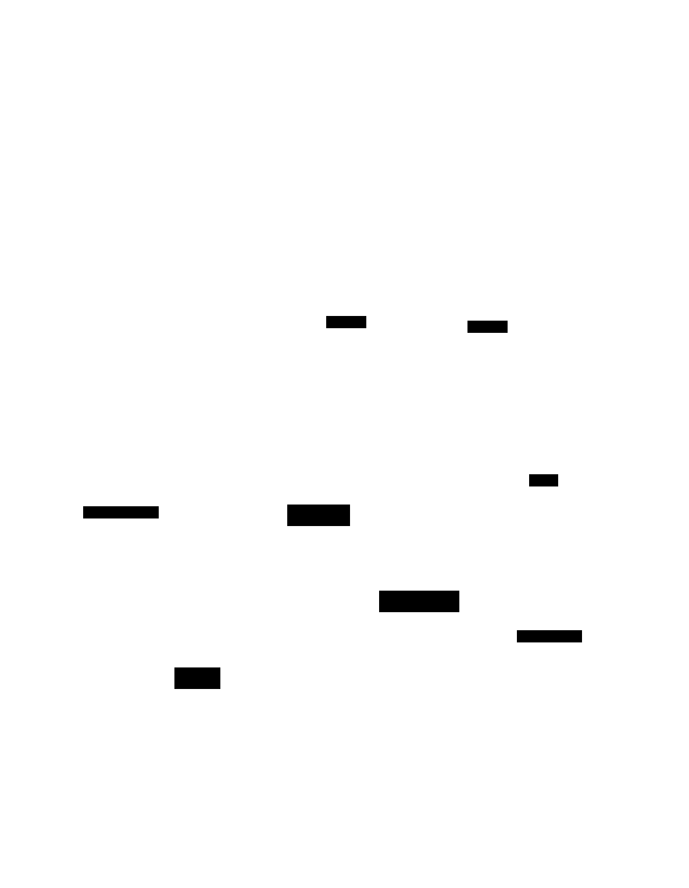
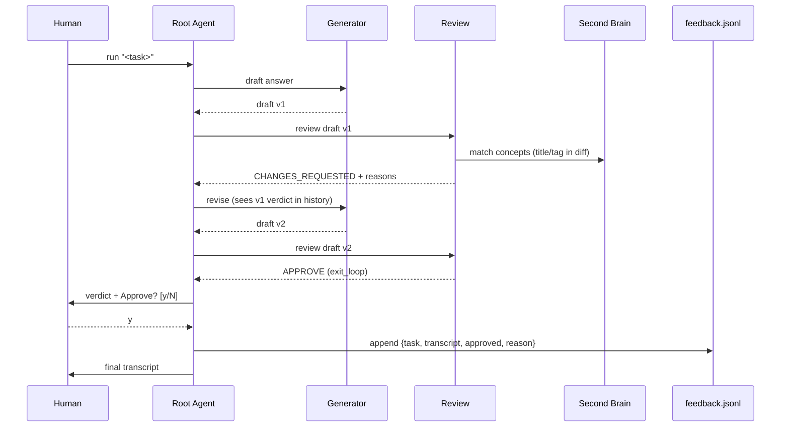
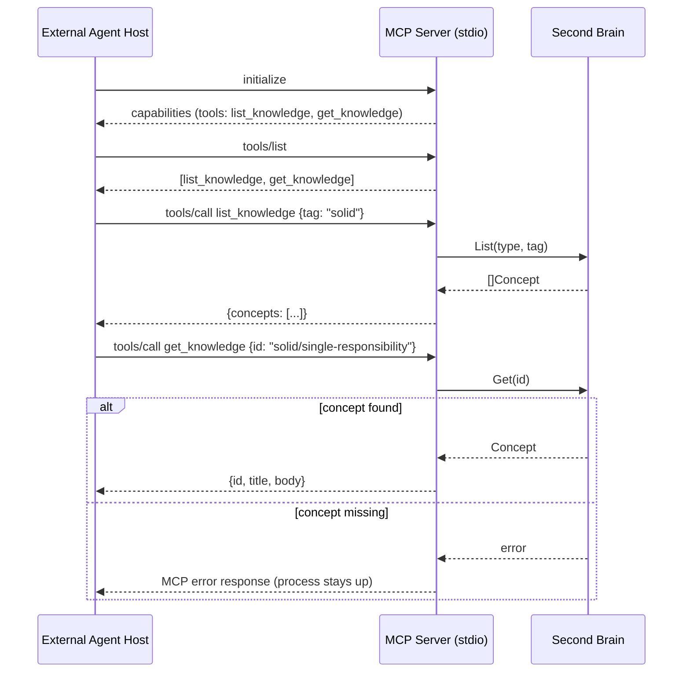

# Architecture overview

`agentic-hooks` is one Go binary with two independent entry points that
share one component. This document walks through both paths and how they
connect. For exhaustive flag/schema listings, see the
[reference docs](../reference/); for step-by-step tasks, see the
[how-to guides](../how-to/).

## Two entry points, one shared component

**`agentic-hooks run "<task>"`** starts the ADK Go v2 runtime in-process: a
Root agent delegates to a Search sub-agent (an MCP client that can query an
externally configured MCP server for supporting context) and to a
self-correcting Generator↔Review loop that drafts and critiques an answer
against the Second Brain. The Review agent reads the Second Brain directly
via a Go function call — no protocol overhead in-process. A converged
verdict is gated by a CLI-level human approve/reject prompt before it's
treated as final output, and every decision (approved or rejected) is
appended to `feedback/feedback.jsonl`.

**`agentic-hooks serve`** starts an MCP server over stdio, independent of
the ADK runtime entirely — no agent pipeline runs on this path. It exposes
the same Second Brain as two read-only MCP tools (`list_knowledge`,
`get_knowledge`) so any external MCP-compatible agent host (Claude Code,
Cursor, etc.) can query it directly.

## Why one shared component instead of two copies

Both entry points read the same `internal/secondbrain` package — a
directory of OKF-frontmatter Markdown files under `knowledge/`, walked and
parsed once per process start. The Review sub-agent calls it directly as a
Go function; the MCP server wraps it as two tool handlers. There is
exactly one source of truth for the Second Brain's content and query
logic, regardless of which entry point is driving a given process. See
[ADR 0004](../adr/0004-second-brain-as-markdown-not-database.md) for why
this is Markdown files rather than a database.

## Why the two entry points don't share a process

`run` and `serve` are separate CLI subcommands, each starting a fresh
process — they are never both active in the same binary invocation. This
matters for one specific wiring detail: when `run` needs a Search MCP
server to point its client at, `--search-mcp-server` can point at this
project's own `serve` subcommand as a valid stand-in (see the
[quick-start tutorial](../tutorials/first-run.md)), which means one
`run` invocation spawns a second, separate `serve` process as a
subprocess. The two entry points are architecturally independent even
when one is used to bootstrap the other.

## Further reading

- [Why ADK Go, not Genkit](why-adk-not-genkit.md) — the runtime choice.
- [Self-correcting loop](self-correcting-loop.md) — how Generator↔Review
  convergence works.
- [HITL design](hitl-design.md) — why approval is a CLI prompt.
- [ADRs](../adr/) — the full set of locked architectural decisions.
