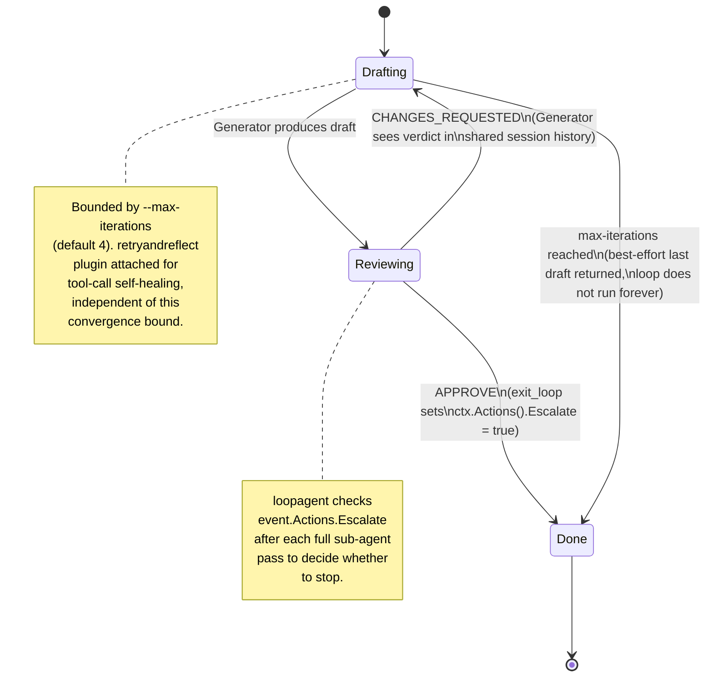

# Why the Generator↔Review loop is built the way it is

The core of `agentic-hooks run` is a self-correcting loop: a Generator
drafts an answer, a Review agent critiques it against the Second Brain, and
the two go back and forth until Review approves or a bound is hit. This
document explains the mechanics behind that loop and why it's built this
way, not how to invoke it (see the [tutorial](../tutorials/first-run.md) for
that) or its exact flags (see the [CLI reference](../reference/cli.md)).

## How convergence actually works

The loop is implemented with ADK Go v2's
`google.golang.org/adk/v2/agent/workflowagents/loopagent`, not a hand-rolled
retry loop. `internal/agent/review.go` calls `exitlooptool.New()` on
`APPROVE`, which sets `ctx.Actions().Escalate = true`. `loopagent` checks
`event.Actions.Escalate` after each full sub-agent pass and stops the loop
there — this is a real termination signal read from the ADK runtime, not a
decorative flag layered on top.

The reason the loop can actually *correct* rather than just repeat the same
draft is session sharing: the Generator and Review sub-agents share the
runner's session, so on iteration 2 the Generator sees the Review agent's
iteration-1 `CHANGES_REQUESTED` verdict in conversation history. Without
that shared history, a second draft attempt would have no information about
what was wrong with the first.

This was proven without a live model call — see
`TestSelfCorrectingLoop_ConvergesAfterCorrection` in
`internal/agent/loop_test.go`, which drives the real
`NewSelfCorrectingLoop` through a real `runner.Run` with scripted
model stand-ins, and asserts both that the loop stops right after
`exit_loop` (not by exhausting `--max-iterations`) and that the generator's
second request literally contains the review agent's first-pass verdict
text.

## Why it's bounded, and why retryandreflect is attached

Two independent resilience layers protect against a task that never
converges:

1. **`--max-iterations`** (default 4): if Review never returns `APPROVE`,
   the loop stops after this many passes and returns the Generator's
   best-effort last draft instead of looping forever. This is a hard
   ceiling on cost and latency, not a quality guarantee — a non-converging
   task still returns *something*, just not necessarily agreed-upon.
2. **`retryandreflect`** (`google.golang.org/adk/v2/plugin/retryandreflect`),
   attached via `runner.Config.PluginConfig` in `cmd/agentic-hooks/run.go`:
   this is tool-call self-healing — resilience against transient tool-call
   failures, a different failure mode than "Review keeps disagreeing." The
   two layers are independent and address different problems: one bounds
   disagreement, the other bounds transient infrastructure flakiness.

## A known, honestly-documented gap

In a live run against a real model (documented in `SESSION_HANDOFF.md`),
the Review agent's own verdict text (`APPROVE`/`CHANGES_REQUESTED`) was not
visible in the streamed `[review]` output — only `[generator]` text printed
before the HITL prompt. The root cause was not diagnosed in that session
(plausibly the model calling `exit_loop` in the same turn without emitting
a separate text part), and it wasn't chased further to avoid additional
live-API cost. This doesn't block the loop from working correctly — the
unit test above proves real convergence independent of what streams to the
terminal — but if you're debugging "why don't I see a review verdict on
screen," this is the known, not-yet-root-caused explanation, not a new bug
you're the first to hit.

## Related decisions

- [ADR 0009](../adr/0009-self-correcting-loop-via-loopagent.md) — the loop
  mechanism itself.
- [HITL design](hitl-design.md) — what happens to a converged verdict
  before it reaches the user.
